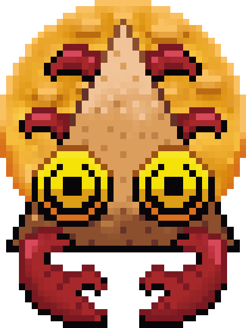

# `Documento del Diseño del Juego (GDD)`

# **Crush Factory**

## **The Gripping Order** 

**Grupo 3 The Gripping Order:**

* **Ángela Fernández Hernández**  
  * [**a.fernandezh.2022@alumnos.urjc.es**](mailto:a.fernandezh.2022@alumnos.urjc.es)  
  * [**https://github.com/Angelagithub1**](https://github.com/Angelagithub1)  
* **Claudia Alejandra Fernández Torrejón**  
  * [**ca.fernandez.2022@alumnos.urjc.es**](mailto:ca.fernandez.2022@alumnos.urjc.es)  
  * [**https://github.com/CF-2003**](https://github.com/CF-2003)  
* **Sofía Marlene García**  
  * [**sm.garcia.2021@alumnos.urjc.es**](mailto:sm.garcia.2021@alumnos.urjc.es)  
  * [**https://github.com/sphaguethy**](https://github.com/sphaguethy)  
* **Alejandra Alcalá Díaz**  
  * [**a.alcalad.2022@alumnos.urjc.es**](mailto:a.alcalad.2022@alumnos.urjc.es)  
  * [https://github.com/AlejandraAD](https://github.com/AlejandraAD)

# **Índice** 

## The Gripping Order

[**Índice**](#índice)

[**Introducción**](#introducción)

1. [Concepto del juego](#concepto-del-juego)

2. [Características principales](#características-principales)

3. [Género](#género)

4. [Propósito y Público objetivo](#propósito-y-público-objetivo)

5. [Estilo visual](#estilo-visual)

6. [Alcance](#alcance)

7. [Plataforma](#plataforma)

8. [Categoría](#categoría)

9. [Licencia](#licencia)

[**Escenario**](#escenario)

1. [Objetivo](#objetivo)

2. [Arte](#arte)
   
3. [Niveles](#niveles)

[**Personajes**](#personajes)

1. [Gancho](#gancho)

2. [Ania](#Ania)

[**Items**](#items)

1. [Piezas](#piezas)

2. [Power Ups](#power-ups)

[**Estados e interfaces**](#estados-e-interfaces)

1. [Diagrama de estados](#diagrama-de-estados)

2. [Interfaces](#interfaces)

3. [Pantalla de inicio](#pantalla-de-inicio)

4. [Tutorial](#tutorial)

5. [Créditos](#créditos)

6. [Elección de jugador](#elección-de-jugador)

7. [Pantalla de juego](#pantalla-de-juego)

8. [Pantalla de victoria](#pantalla-de-victoria)

9. [Pantalla de derrota](#pantalla-de-derrota)

10. [Menú de pausa](#menú-de-pausa)

[**Mecánicas \- Diagrama de Flujo**](#mecánicas---diagrama-de-flujo)

1. [Jugabilidad y controles](#jugabilidad-y-controles)

2. [Flujo del Juego](#flujo-del-juego)

3. [Mecánicas y Físicas](#mecánicas-y-físicas)

4. [Mecánicas de movimiento](#mecánicas-de-movimiento)

5. [Mecánica de lanzamiento de piezas](#mecánica-de-lanzamiento-de-piezas)

6. [Mecánica de recolección de Power Ups](#mecánica-de-recolección-de-power-ups)

7. [Mecánica de Tiempo](#mecánica-de-tiempo)

8. [Mecánicas de supervivencia](#mecánicas-de-supervivencia)

9. [Gravedad](#gravedad)

[**Narrativa**](#narrativa)

[**Sonido**](#sonido)

[**Comunicación**](#comunicación)

[**API REST	22**](#api-rest)

[**Bibliografía	26**](#bibliografía)

# 

# **Introducción** 

Este documento acerca del videojuego Crush Factory desarrollado para la asignatura de Juegos en Red, contiene todas las características y especificaciones de dicho videojuego. Será desarrollado enteramente por los alumnos del grupo 3 y será un documento dinámico que crecerá según se vaya desarrollando el juego.

## **Concepto del juego** 

Crush Factory es un videojuego competitivo para dos jugadores que combina estrategia, reflejo y astucia. Donde cada jugador asume el rol de gancho o de Ania. 
El gancho es una máquina capaz de mover y soltar enormes piezas con un único objetivo, aplastar al Ania. Mientras que Ania es una pequeña y ágil criatura que deberá esquivar estas piezas para mantenerse con vida hasta que se acabe el tiempo. 
Gancho y Ania se enfrentarán en una peligrosa y dinámica fábrica donde las piezas caen. Con un cronómetro recordando el paso del tiempo que sirve como alivio para Ania, pero como una inminente amenaza para el gancho.
Crush Factory busca ofrecer partidas cortas y competitivas, donde la habilidad, la lectura del oponente y el buen timing son esenciales para conseguir la victoria. 
                                                                                                    

## **Características principales** 

Dentro de Crush Factory, al gancho le irán apareciendo diferentes piezas para dejarlas caer sobre Ania, mientras que esta deberá esquivar y saltar estas piezas para sobrevivir hasta que finalice el tiempo. Además, Ania tendrá a su disposición diversos Power Ups que le ayudarán a sobrevivir. Una vez iniciada la partida, el tiempo comenzará a correr de forma constante hasta que Ania muera o este finalice. 

Por un lado, una vez que al gancho le aparezca la pieza, debe intentar soltar la pieza en el momento justo para aplastar a Ania. Si esto ocurre tres veces, Ania se quedará sin vida

Por otro lado, Ania tendrá libertad de movimiento dentro de los límites de la pantalla, ya sea moviéndose de un lado a otro o saltando sobre las piezas que le lancen encima. Además, podrá obtener Power Ups pasando sobre estos cuando aparezcan en la pantalla. 

Es un juego en 2D con cámara fija lateral en una posición estática predeterminada (como cualquier Mario Bros clásico pero sin el desplazamiento).

## **Género** 

El género del juego se clasifica como plataforma, survival y competitivo.

* Plataformas: una de las partes fundamentales del juego de uno de los jugadores es el movimiento y los saltos, ya que debe esquivar las piezas que le caen mediante estas acciones.  
* Supervivencia: el objetivo del jugador que lleva a Ania es sobrevivir el mayor tiempo posible, mientras que el objetivo del otro es impedirlo.  
* Competitivo: ambos jugadores tienen objetivos contrarios, no pueden ganar ambos, por lo que hay un constante ambiente de enfrentamiento entre ellos.

## **Propósito y Público objetivo** 

El propósito principal del juego es ofrecer una experiencia divertida, accesible y competitiva para dos jugadores, centrada en enfrentamientos dinámicos y partidas de corta duración.  Con mecánicas simples a contrarreloj, lo que genera un ritmo ágil y una tensión constante, manteniendo a ambos jugadores al borde de sus asientos en todo momento.

Crush Factory busca equilibrar la diversión casual con la intensidad de la competencia, siendo sencillo de comprender pero con suficiente profundidad para que cada partida se sienta única. Permitiendo que tanto jugadores novatos como veteranos puedan disfrutarlo sin que la curva de dificultad suponga un obstáculo.

El juego está pensado para un público amplio y diverso, incluyendo niños, jóvenes y adultos que busquen experiencias multijugador rápidas, accesibles y llenas de acción. Busca fomentar la interacción social y la diversión compartida ya sea en partidas locales entre amigos o entornos más competitivos. Todo esto con el objetivo de ofrecer un reto estimulante que mantenga el interés, sin caer en la frustración.

## **Estilo visual** 

El estilo visual del juego será pixel art con colores saturados y animaciones dinámicas para transmitir una sensación de viveza y emoción a los jugadores. 

La paleta de colores cambiará según se avance en los niveles, y los espacios están construidos visualmente como si fuese una máquina de recreativos. También, la interfaz tendrá un estilo retro integrado con la estética del resto del juego. 

Se han tomado como referencia las máquinas  de los recreativos en las que se maneja un gancho para recoger objetos, pero la idea se invirtió para que este los lanzara y el personaje los esquivara.

## **Alcance** 

Crush Factory está pensado como un juego independiente y completo, diseñado para ofrecer una experiencia sólida y divertida en una única entrega, sin planes iniciales de una secuela debido a su simplicidad y naturaleza del concepto. Sin embargo, el desarrollo contempla la posibilidad de expandir el contenido mediante futuras expansiones, como la inclusión de nuevos mapas, mejoras que amplíen la rejugabilidad y variedad. 
Además, aunque el lanzamiento está pensado para PC, no se descarta la opción de hacerlo accesible a otras plataformas en función del éxito y la acogida que reciba entre la comunidad de jugadores. Estas decisiones se tomarán con base en el interés y la demanda para garantizar que cualquier extensión o adaptación mantenga la calidad y experiencia original del juego.

## **Plataforma** 

Crush Factory será desarrollado principalmente para ordenador aprovechando la accesibilidad y la conectividad que esta plataforma ofrece para partidas en línea. Permitiendo a los jugadores enfrentarse entre sí desde cualquier lugar, facilitando el juego competitivo a distancia y ampliando el alcance del juego. La elección de PC también busca asegurar un rendimiento óptimo y una experiencia cómoda para el usuario con controles adaptados y una interfaz intuitiva..

## **Categoría** 

Análisis DAFO:

|  | Interno | Externo |
| :---- | :---- | :---- |
| Negativos  | Debilidades: Limitado a multijugador local Mecánicas repetitivas a largo plazo Curva de aprendizaje limitada Poca personalización de personajes | Amenazas: Competencia en el mercado Falta de recursos para marketing Desinterés de los jugadores por juegos locales |
| Positivos | Fortalezas: Dinámica Competitiva Variedad de jugabilidad dependiendo del rol elegido Juego de duración corta Power Ups y elementos interactivos | Oportunidades: Multijugador online Ampliación de mapas Integración con redes sociales |

## **Licencia** 

Crush Factory es un juego en su totalidad original, desarrollado desde cero y sin estar basado en ninguna otra franquicia, marca o adaptación de otro tipo de producto multimedia preexistente. Su diseño, personajes, mecánicas y estética son fruto de una creación única y autónoma, lo que garantiza una identidad propia y distintiva en el mercado.
Además se contemplan planes a futuro  para el lanzamiento de contenidos adicionales que expandan y enriquezcan esta entrega, manteniendo la originalidad y coherencia del universo creado. 
Esta independencia creativa permite al proyecto tener libertad para evolucionar según las necesidades y el feedback de la comunidad, asegurando un desarrollo alineado con la visión original del juego y las expectativas de sus jugadores.
El juego se rige por la licencia Apache-2.0 .

# **Escenario** 

## **Descripción** 

El escenario en Crush Factory está inspirado en la estética clásica de las máquinas arcade de los años 80 y 90, evocando la nostalgia de esa época dorada de los videojuegos. El entorno presenta un fondo oscuro, diseñado para no distraer la atención y dando protagonismo al gancho y a Ania, pero al mismo tiempo creando una atmósfera intensa. 
En este fondo sobrio y plano, se destacan claramente los elementos clave del juego. Para añadir dinamismo visual y ayudar en la accesibilidad, los Power Ups y otros objetos interactivos cuentan con colores vivos y brillantes, que contrastan fuertemente con el fondo para facilitar su identificación rápida durante la partida.
Esta combinación de un diseño simple pero efectivo, con referencias retro y un uso inteligente del color, contribuye a crear un escenario que es a la vez funcional y atractivo, invitando a los jugadores a sumergirse en partidas rápidas y emocionantes.

## **Niveles**
Nivel 1: Cementerio abandonado
* Ambiente: Niebla espesa, lápidas rotas, árboles secos y cuervos que observan desde las ramas.
* Estética: Colores apagados y menos saturados para transmitir una atmósfera melancólica.
* Jugabilidad: Ania puede interactuar con las lápidas, usándolas como plataformas para subir y saltar.

  
Nivel 2: Morgue subterránea
* Ambiente: Pasillos estrechos, luces parpadeantes, refrigeradores abiertos y sonidos metálicos constantes.
* Estética: Fría y clínica, con tonos azulados y grises. El sonido juega un papel importante en la tensión.
* Jugabilidad: Ania puede saltar sobre los cajones de cadáveres abiertos
  
Nivel 3: Fiesta fúnebre en el más allá
* Ambiente: Una dimensión surrealista donde los muertos celebran su paso al otro mundo. Espíritus bailan, mesas flotan y la música lúgubre llena el aire.
* Estética: Colores vivos y contrastantes, con elementos visuales extravagantes como velas negras, humo de colores y luces flotantes.
* Jugabilidad: Ania puede caminar sobre mesas y sillas.

# **Personajes** 

## **Gancho** 

Es uno de los personajes que puede llevar un jugador. Consiste en una garra inspirada en los juegos de gancho de las salas de recreativos, que, al contrario que estos, dejará caer piezas en vez de cogerlas.

Se cuenta con 3 skins diferentes entre las que puede elegir el jugador, cada una con las variaciones de color correspondientes según el power up que se recoja:

* Normal
  
* Naranja
*   
* Rosa
* 

## **Ania** 

Es el otro personaje que puede llevar un jugador. Consiste en una pequeña criatura de colores vivos parecida a un escarabajo. Esta compuesta por fragmentos de sprites corrompidos, dando así la apariencia de un glitch. Su supervivencia depende por completo de su capacidad para predecir los movimientos de su oponente.

Se cuenta con 3 skins diferentes entre las que puede elegir el jugador, cada una con las variaciones de color correspondientes según el power up que se recoja:

* Normal

* Lazo

* Sombrero

# **Items** 

## **Piezas** 

Siguiendo con la narrativa actual del juego, la cual tiene una temática oscura, el gancho lanzará objetos típicos de funerales a Ania, como guadañas, ataúdes, jarrones de cenizas y huesos varios.

## **Power Ups** 

Los Power Ups serán llamas de diferentes colores, y son exclusivos para el jugador que lleva a Ania. Sus efectos se acaban a los 5 segundos, tiempo en el que Ania se tiñe del color del Power Up, y no se pueden tener dos efectos a la vez, solo se contará el primero que coja hasta que el tiempo de este haya acabado.

* Azul: permite que el jugador haga un doble salto al mantener pulsado el espacio.  
* Amarillo: es una trampa, hace que el jugador se quede congelado, haciendo así más fácil que el gancho le tire una pieza.  
* Rojo: hace al jugador invulnerable, permitiendo una mayor tranquilidad durante ese tiempo.  
* Verde: aumenta la velocidad del jugador, haciendo más difícil que el gancho le acierte con una pieza.

# **Estados e interfaces** 

## **Diagrama de estados** 

Este diagrama irá creciendo con el tiempo según se añadan nuevas pantallas en las próximas entregas, como un futuro chat y la selección de jugar en local u online.

## **Interfaces** 

Actualmente solo se tiene el diseño de cómo serán las interfaces, aunque su estilo combinará lo retro con una temática oscura, unificando los dos conceptos principales del juego.

### Pantalla de inicio 

### Tutorial 

### Créditos 

### Elección de jugador 

Aunque esta pantalla no es accesible a nivel local, ya se ha diseñado e implementado de cara al modo online.

### Pantalla de juego 

### Pantalla de victoria/derrota 

### Menú de pausa

# **Mecánicas \- Diagrama de Flujo** 

## **Jugabilidad y controles** 

Al inicio de cada partida en Crush Factory, los jugadores tendrán que elegir entre los dos personajes disponibles del juego, cada uno con mecánicas y objetivos claramente diferenciados que definen su estilo de juego:

* Ania: Este personaje se controla mediante las teclas A (moverse a la izquierda), D (moverse a la derecha), y la barra espaciadora para el salto. La misión de Ania es sobrevivir durante un tiempo limitado indicado por un cronómetro visible en pantalla, mientras esquiva las diferentes piezas que le tira el jugador del gancho. Para ayudar en su supervivencia durante la partida, el jugador podrá recoger diferentes Power Ups que le darán habilidades especiales o ventajas temporales durante 10 segundos, como mayor velocidad, saltos más altos o escudos protectores. Pero no todos son Power Ups, también aparecerán trampas que eviten que pueda seguir moviéndose.  
* Gancho: Este personaje se mueve con las flechas ← (moverse a la izquierda), → (moverse a la derecha), y el enter para lanzar piezas sobre  Ania. El objetivo del gancho es aplastar al jugador de Ania antes de que se acabe el tiempo, utilizando estratégicamente la posición y el lanzamiento de las piezas para encerrar y eliminar a su oponente.

  ## **Flujo del Juego** 

## **Mecánicas y Físicas** 

### Mecánicas de movimiento 

Tanto Ania como el gancho se mueven exclusivamente de izquierda a derecha, con la excepción de que Ania puede saltar también para llegar a distintas plataformas.

### Mecánica de lanzamiento de piezas 

Es una mecánica exclusiva del gancho que consiste en lanzar las piezas presionando el enter para intentar aplastar al jugador y ganar la partida.

### Mecánica de recolección de Power Ups 

Es una mecánica exclusiva de Ania que consiste en colisionar con distintos Power Ups que aparecerán de manera aleatoria por la pantalla de juego para poder obtener poderes durante un limitado período de tiempo. 
Sin embargo, el gancho lo que deberá hacer es lanzar una pieza sobre los Power Ups para hacerlos desaparecer y que Ania no pueda usarlos.

### Mecánica de Tiempo 

Cada partida dura 1 minuto y 30 segundos, y es una de las claves de la supervivencia. Cuando finalice ese tiempo, se mostrará la partida de victoria para Ania, dado que si antes el gancho consigue aplastar a Ania, el tiempo no llegará a terminar.

### Mecánicas de supervivencia 

Es una mecánica exclusiva de Ania consistente en sobrevivir el tiempo indicado esquivando las piezas que va tirando el gancho. Si no logra esquivarlas y le golpea 3 veces perderá la partida.

### Gravedad 

Tanto las piezas que tira el gancho como Ania sufren de gravedad, por lo que caen hacia abajo cuando están en el aire, ya sea porque sean soltadas por el gancho o porque el jugador haya decidido saltar con Ania. Sin embargo, mientras que Ania se queda en el suelo, las piezas lo atraviesan y salen fuera de la pantalla.

# **Narrativa** 

Ania baja al sótano de su abuelo, un obsesionado de los videojuegos que guarda un montón de máquinas relacionadas con estos, desde consolas actuales hasta máquinas arcade. Una de estas parece estar todavía encendida, así que se acerca a ver que juego contiene, pero en cuanto pone la mano encima de la palanca, la máquina la absorbe y se ve transformada en un bicho. 
Al mirar hacia arriba, ve un gancho oscilando sobre su cabeza. Lo que no sabe es que ese gancho encierra el alma de uno de sus antepasados que al igual que ella había quedado atrapado en aquella máquina  hace muchos años y había muerto allí, condenado a permanecer como parte del mecanismo. 
La única forma de que su antepasado pueda descansar en paz es que otro tome su lugar. Sin dudarlo, lanza una pieza sobre Ania, con intención de matarla y liberar su propia alma. Pero Ania reacciona a tiempo y salta hacia un lado para esquivarla, dando inicio así al juego.

# **Sonido** 

El sonido en Crush Factory juega un papel fundamental para mayor inmersión, dando una experiencia más tensa y dinámica. El uso de música ambiental, efectos sonoros y sonidos puntuales están diseñados para intensificar la competitividad de la partida y destacando el paso del tiempo como una constante amenaza. 

La música de fondo mostrará una progresión que aumentará en intensidad a medida que el tiempo avance. Durante los primeros momentos, la música será sutil y relajada pero conforme el reloj se acerque al final la intensidad incrementará con melodías más rápidas y tensas creando una atmósfera de urgencia. 

# **Comunicación** 

Se buscará construir una base de jugadores comprometidos mediante el uso de redes sociales. Se crearán perfiles oficiales del juego en plataformas como Twitter e Instagram donde se irán publicando contenidos adicionales o arte oficial del juego. 

Además de realizar encuestas o preguntas para que el público objetivo pueda interactuar con los desarrolladores y que estos puedan escuchar sus opiniones y feedback para mejorar el juego. Buscando hacer sentir que la opinión del jugador es importante para el equipo de desarrollo. 

El videojuego **Crush Factory**, desarrollado por *The Gripping Order*, se distribuirá bajo una **licencia freeware**. Esto significa que el juego se ofrece de manera gratuita para su descarga y uso personal, sin coste alguno para el usuario.

# **API REST** 

Se partió asignando en el *app.js*  el prefijo de cada grupo de rutas.  

*UserRoutes.js*

Cuenta con un total de siete rutas variando entre get, post, delete y put. 

Entre los get se tiene:

* loginUser: En su prefijo se debe especificar el usuario y contraseña para poder obtener, si es que está registrado, la confirmación para poder iniciar sesión. Se optó por get puesto a que no hay ningún tipo de modificación de datos.  
* getSkins: Al igual que loginUser se debe especificar el usuario del que se quieren obtener las skins guardadas. Este método devuelve las preferencias de skins que se han guardado del jugador que las solicita.  Se optó por get puesto a que no hay ningún tipo de modificación en los datos.  
* AllPlayersSkins: Permite obtener las skins que han sido configuradas por ambos jugadores. Permitiendo conocer al jugador 1 la skin que ha elegido el jugador 2 y viceversa. 

Respecto al post solo se tiene registerUser. Puesto que es el único que añade un nuevo dato. Permitiendo el registro de nuevas cuentas verificando que no sean cuentas ya existentes.

Por otro lado, el delete se tiene solo deleteUser, el cual permite eliminar alguna cuenta ya registrada. Siempre y cuando exista y no esté en uso en ese momento.

Por último, respecto al put se tiene changeSkinAnia y changeSkinGancho, ambos métodos permitiendo cambiar la skin de Ania o del Gancho. Debido a que modifica los datos del usuario se optó por usar put.

*ConnectionRoutes.js*

Cuenta con solo tres rutas compuesta por un post y dos get. 

* checkConnection: Es el post que envía constantemente el cliente para confirmar al servidor que sigue conectado. Este método añade nuevos clientes si es que es la primera vez que se registra su conexión o actualiza el momento en que mandó por última vez el mensaje. Por lo que si un cliente lleva más de dos segundos sin dar señales se lo detecta como desconectado y es eliminado de la lista de usuarios conectados.  Se optó por usar post debido a que más allá de solo actualizar también agrega nuevos usuarios, aunque podría usarse de igual forma un put.  
* userconnected: Se trata de un get al que se debe especificar el usuario, que permite conocer si el usuario mandado está conectado o no.   
* users: Este get permite conocer el número de usuarios conectados. Permitiendo mostrarlo en pantalla.

*ConfigurationRoutes.js*

Cuenta con siete rutas, cuatro post y tres get.

Entre los post estan:

* requestChangeScreen: Este post permite al cliente solicitar un cambio de pantalla. Permitiendo ya sea pasar a la pantalla de MenuEleccionJugador y de allí a la pantalla de PantallaJuego o volver a la pantalla de MenuPrincipal. El servidor tiene guardados variables las cuales se actualizan con estas llamadas.   
  * Si uno de los jugadores le da al boton de jugar en el menú principal, se podrá acceder a esta pantalla  
  * Si uno de los jugadores le da al botón de volver en la pantalla de elección de jugador ambos podrán volver al menú principal.   
  * Solo si los dos jugadores le han dado al botón de jugar en la pantalla de elección de jugador se podrá iniciar la partida  
* setChangesCharacters: Este método permite a los jugadores elegir si quieren usar a Ania o el gancho. Verificando siempre que el otro jugador no lo hubiera escogido antes. Así como si quieren cambiar de personaje por otro si es que no está elegido.   
* confirmChange: Este método permite realizar una limpieza con el cambio de pantallas, una vez que se realiza una, el cliente confirma que ha cambiado de pantalla y cuando ambos clientes confirmen este cambio entonces se resetean algunos datos guardados en el servidor.   
* LimpiezaPorEliminacion: Este método es parecido a confirmChange solo que en vez de esperar a las dos confirmaciones de ambos clientes. Este limpia los datos con la llegada de la primera solicitud, puesto que este método solo se llama si uno de los clientes se ha desconectado. 

Entre los get se tiene:

* canChangeScreen: Este get permite saber al cliente si debe cambiar de pantalla o no. Se llama constantemente y dependiendo de las llamadas previas recibidas con requestChangeScreen, cambiará de pantalla o no. Esto permite que ambos jugadores puedan cambiar casi al mismo tiempo de pantalla.  
* choosen: Este get permite obtener qué usuario ha escogido a Ania y que usuario ha escogido al Gancho. Si es que alguno de los dos o los dos no han sido escogidos por un usuario mandarán espacios en blanco.   
* getCharacter: Se le debe proporcionar el usuario. Devolviendo la elección del usuario, si ha escogido a Ania devolverá un string con Ania y de igual forma con el gancho. 

Para manejar las conexiones se tiene una pantalla que se ejecuta en todo momento encima de todas las escenas, ConnectionMenu. La cual hace las llamadas keepalive al servidor. 

Si el servidor se ha caído, siempre y cuando no se encuentre en la pantalla de MenuLogin, aparecerá una pantalla encima informando que se ha caído el servidor y que está intentando reconectarse. En caso de la pantalla de MenuLogin, aparecerá un mensaje informando que el servidor no está disponible en esos momentos si intenta realizar alguna petición. 

Cuando el servidor se vuelve a conectar, los cliente al detectar esto si estaban registrados realizarán login de nuevo. Puesto ConnectionMenu guarda el usuario y la contraseña si es que ya inició sesión. Permitiendo retomar desde el punto en que estaba antes de que se cayera.  En caso de la pantalla de MenuEleccionJugador, si ya se ha enviado una confirmación para comenzar a jugar se reenvía al servidor así como si ya se ha elegido algún personaje, permitiendo que la elección de los personajes se restablezca una vez que el servidor vuelva a funcionar. Debido a que cada cliente puede tardar un poco más en reconectarse y hacer todo este proceso. Se le da un lapso de un segundo para conectarse, antes de que se considere que se ha desconectado. 

Si uno de los clientes se desconecta, en la pantalla de inicio no permitirá iniciar el juego, puesto que requiere de dos jugadores. En caso de la pantalla de menú de elección del jugador se manda de nuevo a la pantalla de inicio al jugador que siga conectado. Por último, respecto a la pantalla de juego, si se detecta que falta un jugador entonces se da directamente la victoria al jugador que siga conectado. Esto último, teniendo en cuenta la siguiente fase donde el juego será completamente en línea. Por el momento si los dos siguen conectados el final de la partida se sigue determinando de principio por el jugador que gane o pierda de forma local. 

Por último, si un tercer jugador trata de iniciar sesión o registrarse, aparecerá un mensaje en pantalla avisando que no puede hacerlo puesto a que ya hay dos jugadores conectados. 

# **Bibliografía** 

[https://www.ordenacionjuego.es/operadores-juego/informacion-operadores/licencias-juego](https://www.ordenacionjuego.es/operadores-juego/informacion-operadores/licencias-juego)

[https://pixabay.com](https://pixabay.com)

[DJARTMUSIC](https://pixabay.com/es/users/djartmusic-46653586/)\- The World of 8 Bit Games

[DJARTMUSIC](https://pixabay.com/es/users/djartmusic-46653586/)\- I Love my 8 Bit Game Console

Victory2: [u\_ss015dykrt](https://pixabay.com/es/users/u_ss015dykrt-26759154/) \- Brass fanfare with timpani and winchimes

Boton\_Seleccionado: [Emilianodleon](https://pixabay.com/es/users/emilianodleon-41744987/) \- Select Button UI

Boton\_Presionado: [freesound\_community](https://pixabay.com/es/users/freesound_community-46691455/) \- button-pressed

Gancho\_Disparo: [freesound\_community](https://pixabay.com/es/users/freesound_community-46691455/) \- 8 Bit Cannon Fire

[freesound\_community](https://pixabay.com/es/users/freesound_community-46691455/) \- Colorful Potions

Gancho\_Disparo2: [freesound\_community](https://pixabay.com/es/users/freesound_community-46691455/) \- OPL3ElecSnare1

Victory: [freesound\_community](https://pixabay.com/es/users/freesound_community-46691455/) \- Success fanfare trumpets

Ania\_Hurt: [freesound\_community](https://pixabay.com/es/users/freesound_community-46691455/) \- Player Hurt

Ania\_Hit: [freesound\_community](https://pixabay.com/es/users/freesound_community-46691455/) \- playerhit

Powerup: [freesound\_community](https://pixabay.com/es/users/freesound_community-46691455/) \- 8-Bit Powerup

