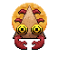

# 

# **Crush Factory**

## **The Gripping Order** 

**Grupo 3 Nombre de equipo:**

* **Ángela Fernández Hernández**  
  * [**a.fernandezh.2022@alumnos.urjc.es**](mailto:a.fernandezh.2022@alumnos.urjc.es)  
  * [**https://github.com/Angelagithub1**](https://github.com/Angelagithub1)  
* **Claudia Alejandra Fernández Torrejón**  
  * [**ca.fernandez.2022@alumnos.urjc.es**](mailto:ca.fernandez.2022@alumnos.urjc.es)  
  * [**https://github.com/CF-2003**](https://github.com/CF-2003)  
* **Sofía Marlene García**  
  * [**sm.garcia.2021@alumnos.urjc.es**](mailto:sm.garcia.2021@alumnos.urjc.es)  
  * [**https://github.com/sphaguethy**](https://github.com/sphaguethy)  
* **Alejandra Alcalá Díaz**  
  * [**a.alcalad.2022@alumnos.urjc.es**](mailto:a.alcalad.2022@alumnos.urjc.es)  
  * [https://github.com/AlejandraAD](https://github.com/AlejandraAD)

# **Índice** 

[The Gripping Order	0]

[**Índice	1**](#índice)

[**Introducción	3**](#introducción)

[Concepto del juego	3](#concepto-del-juego)

[Características principales	3](#características-principales)

[Género	3](#género)

[Propósito y Público objetivo	4](#propósito-y-público-objetivo)

[Estilo visual	4](#estilo-visual)

[Alcance	4](#alcance)

[Plataforma	4](#plataforma)

[Categoría	4](#categoría)

[Licencia	5](#licencia)

[**Escenario	6**](#escenario)

[Objetivo	6](#objetivo)

[Arte	6](#arte)

[**Personajes	6**](#personajes)

[Gancho	6](#gancho)

[Bicho	6](#bicho)

[**Items	6**](#items)

[Piezas	6](#piezas)

[Power Ups	6](#power-ups)

[**Estados e interfaces	6**](#estados-e-interfaces)

[Diagrama de estados	6](#diagrama-de-estados)

[Interfaces	7](#interfaces)

[Pantalla de inicio	7](#pantalla-de-inicio)

[Tutorial	8](#tutorial)

[Créditos	8](#créditos)

[Elección de jugador	9](#elección-de-jugador)

[Pantalla de juego	9](#pantalla-de-juego)

[Pantalla de victoria	10](#pantalla-de-victoria)

[Pantalla de derrota	10](#pantalla-de-derrota)

[Menú de pausa	10](#menú-de-pausa)

[**Mecánicas \- Diagrama de Flujo	10**](#mecánicas---diagrama-de-flujo)

[Jugabilidad y controles	10](#jugabilidad-y-controles)

[Flujo del Juego	10](#flujo-del-juego)

[Mecánicas y Físicas	11](#mecánicas-y-físicas)

[Mecánicas de movimiento	11](#mecánicas-de-movimiento)

[Mecánica de lanzamiento de piezas	11](#mecánica-de-lanzamiento-de-piezas)

[Mecánica de recolección de Power Ups	11](#mecánica-de-recolección-de-power-ups)

[Mecánica de Tiempo	11](#mecánica-de-tiempo)

[Mecánicas de supervivencia	11](#mecánicas-de-supervivencia)

[Gravedad	11](#gravedad)

[**Narrativa	12**](#narrativa)

[**Sonido	12**](#sonido)

[**Comunicación	12**](#comunicación)

[**Bibliografía	12**](#bibliografía)

# 

# **Introducción** 

Este documento acerca del videojuego Crush Factory desarrollado para la asignatura de Juegos en Red, contiene todas las características y especificaciones de dicho videojuego. Será desarrollado enteramente por los alumnos del grupo 3 y será un documento dinámico que crecerá según se vaya desarrollando el juego.

## **Concepto del juego** 

Crush Factory es un videojuego competitivo para dos jugadores que combina estrategia, reflejo y astucia. Donde cada jugador asume el rol de gancho o de bicho. 
El gancho es una máquina capaz de mover y soltar enormes piezas con un único objetivo, aplastar al bicho. Mientras que el bicho es una pequeña y ágil criatura que deberá esquivar estas piezas para mantenerse con vida hasta que se acabe el tiempo. 
Gancho y bicho se enfrentarán en una peligrosa y dinámica fábrica donde las piezas caen. Con un cronómetro recordando el paso del tiempo que sirve como alivio para el bicho pero como una inminente amenaza para el gancho.
Crush Factory busca ofrecer partidas cortas y competitivas, donde la habilidad, la lectura del oponente y el buen timing son esenciales para conseguir la victoria. 
                                                                                                    

## **Características principales** 

Dentro de Crush Factory, al gancho le irán apareciendo diferentes piezas para dejarlas caer sobre el bicho, mientras que este deberá esquivar y saltar estas piezas para sobrevivir hasta que finalice el tiempo. Además, el bicho tendrá a su disposición diversos Power Ups que le ayudarán a sobrevivir. Una vez iniciada la partida, el tiempo comenzará a correr de forma constante hasta que el bicho muera o este finalice. 

Por un lado, una vez que a la garra le aparezca la pieza, debe intentar soltarla sobre el bicho moviéndose de  izquierda a derecha y soltarla para intentar aplastarlo.

Por otro lado, el bicho tendrá libertad de movimiento dentro de los límites de la pantalla, ya sea moviéndose de un lado a otro o saltando sobre las piezas que le lancen encima. Además, podrá obtener Power Ups pasando sobre estos cuando aparezcan en la pantalla. 

## **Género** 

El género del juego se clasifica como plataforma, survival y competitivo.

* Plataformas: una de las partes fundamentales del juego de uno de los jugadores es el movimiento y los saltos, ya que debe esquivar las piezas que le caen mediante estas acciones.  
* Supervivencia: el objetivo del jugador que lleva al bicho es sobrevivir el mayor tiempo posible, mientras que el objetivo del otro es impedirlo.  
* Competitivo: ambos jugadores tienen objetivos contrarios, no pueden ganar ambos, por lo que hay un constante ambiente de enfrentamiento entre ellos.

## **Propósito y Público objetivo** 

El propósito principal del juego es ofrecer una experiencia divertida, accesible y competitiva para dos jugadores, centrada en enfrentamientos dinámicos y partidas de corta duración.  Con mecánicas simples a contrarreloj, lo que genera un ritmo ágil y una tensión constante, manteniendo a ambos jugadores al borde de sus asientos en todo momento.

Crush Factory busca equilibrar la diversión casual con la intensidad de la competencia, siendo sencillo de comprender pero con suficiente profundidad para que cada partida se sienta única. Permitiendo que tanto jugadores novatos como veteranos puedan disfrutarlo sin que la curva de dificultad suponga un obstáculo.

El juego está pensado para un público amplio y diverso, incluyendo niños, jóvenes y adultos que busquen experiencias multijugador rápidas, accesibles y llenas de acción. Busca fomentar la interacción social y la diversión compartida ya sea en partidas locales entre amigos o entornos más competitivos. Todo esto con el objetivo de ofrecer un reto estimulante que mantenga el interés, sin caer en la frustración.

## **Estilo visual** 

El estilo visual del juego será pixel art con colores saturados y animaciones dinámicas para transmitir una sensación de viveza y emoción a los jugadores. 

La paleta de colores cambiará según se avance en los niveles, y los espacios están construidos visualmente como si fuese una máquina de recreativos. También, la interfaz tendrá un estilo retro integrado con la estética del resto del juego. 

Se han tomado como referencia las máquinas  de los recreativos en las que se maneja un gancho para recoger objetos, pero la idea se invirtió para que este los lanzara y el personaje los esquivara.

## **Alcance** 

Crush Factory está pensado como un juego independiente y completo, diseñado para ofrecer una experiencia sólida y divertida en una única entrega, sin planes iniciales de una secuela debido a su simplicidad y naturaleza del concepto. Sin embargo, el desarrollo contempla la posibilidad de expandir el contenido mediante futuras expansiones, como la inclusión de nuevos mapas, mejoras que amplíen la rejugabilidad y variedad. 
Además, aunque el lanzamiento está pensado para PC, no se descarta la opción de hacerlo accesible a otras plataformas en función del éxito y la acogida que reciba entre la comunidad de jugadores. Estas decisiones se tomarán con base en el interés y la demanda para garantizar que cualquier extensión o adaptación mantenga la calidad y experiencia original del juego.

## **Plataforma** 

Crush Factory será desarrollado principalmente para ordenador aprovechando la accesibilidad y la conectividad que esta plataforma ofrece para partidas en línea. Permitiendo a los jugadores enfrentarse entre sí desde cualquier lugar, facilitando el juego competitivo a distancia y ampliando el alcance del juego. La elección de PC también busca asegurar un rendimiento óptimo y una experiencia cómoda para el usuario con controles adaptados y una interfaz intuitiva..

## **Categoría** 

Análisis DAFO:

|  | Interno | Externo |
| :---- | :---- | :---- |
| Negativos  | Debilidades: Limitado a multijugador local Mecánicas repetitivas a largo plazo Curva de aprendizaje limitada Poca personalización de personajes | Amenazas: Competencia en el mercado Falta de recursos para marketing Desinterés de los jugadores por juegos locales |
| Positivos | Fortalezas: Dinámica Competitiva Variedad de jugabilidad dependiendo del rol elegido Juego de duración corta Power Ups y elementos interactivos | Oportunidades: Multijugador online Ampliación de mapas Integración con redes sociales |

## **Licencia** 

Crush Factory es un juego en su totalidad original, sin estar basado en ninguna otra franquicia o adaptación de otro tipo de producto multimedia. Con planes a futuro de contenidos adicionales para esta entrega. 

# **Escenario** 

## **Descripción** 

El escenario toma como referencias las máquinas arkade de los años 80 y 90, con un fondo oscuro aunque plano en el que destacarán el gancho y el bicho, además de los colores vivos de los Power Ups. 

## **Arte**

# **Personajes** 

## **Gancho** 

Es uno de los personajes que puede llevar un jugador. Consiste en una garra inspirada en los juegos de gancho de las salas de recreativos, que, al contrario que estos, dejará caer piezas en vez de cogerlas.

## **Bicho** 

Es el otro personaje que puede llevar un jugador. Consiste en 

# **Items** 

## **Piezas** 

Siguiendo con la narrativa actual del juego, la cual tiene una temática oscura, el gancho lanzará objetos típicos de funerales al bicho, como guadañas, ataúdes, jarrones de cenizas y huesos varios.

## **Power Ups** 

Los Power Ups serán llamas de diferentes colores, y son exclusivos para el jugador que lleva al bicho. Sus efectos se acaban a los 5 segundos, sea cual sea el Power Up, y no se pueden tener dos efectos a la vez, solo se contará el primero que coja hasta que el tiempo de este haya acabado.

* Azul: permite que el jugador haga un doble salto al mantener pulsado el espacio.  
* Amarillo: es una trampa, hace que el jugador se quede congelado, haciendo así más fácil que el gancho le tire una pieza.  
* Rojo: hace al jugador invulnerable, permitiendo una mayor tranquilidad durante ese tiempo.  
* Verde: aumenta la velocidad del jugador, haciendo más difícil que el gancho le acierte con una pieza.

# **Estados e interfaces** 

## **Diagrama de estados** 

![][image2]

Este diagrama irá creciendo con el tiempo según se añadan nuevas pantallas en las próximas entregas, como un futuro chat y la selección de jugar en local u online.

## **Interfaces** 

Actualmente solo se tiene el diseño de cómo serán las interfaces, aunque su estilo combinará lo retro con una temática oscura, unificando los dos conceptos principales del juego.

### Pantalla de inicio 

![][image3]

### Tutorial 

![][image4]

### Créditos 

![][image5]

### Elección de jugador 

![][image6]

### Pantalla de juego 

![][image7]

### Pantalla de victoria/derrota 

![][image8] 

### Menú de pausa

![][image9]

# **Mecánicas \- Diagrama de Flujo** 

## **Jugabilidad y controles** 

Al inicio, los jugadores tendrán que elegir entre los dos personajes del juego, y cada uno poseerá diferentes mecánicas y objetivos:

* Bicho: se mueve con las teclas a (moverse a la izquierda), d (moverse a la derecha), y la barra espaciadora para el salto. Su objetivo es sobrevivir durante un tiempo limitado indicado por un cronómetro, mientras esquiva las diferentes piezas que le tira el jugador. Durante la partida, el jugador podrá coger diferentes Power Ups que le darán distintos poderes durante 10 segundos.  
* Gancho: se mueve con la flecha ← (moverse a la izquierda), → (moverse a la derecha), y el enter para lanzarla. Su objetivo es aplastar al jugador antes de que se acabe el tiempo.

  ## **Flujo del Juego** 

AQUÍ VA EL DIAGRAMA DE FLUJO DEL AVERNO

## **Mecánicas y Físicas** 

### Mecánicas de movimiento 

Tanto el bicho como el gancho se mueven exclusivamente de izquierda a derecha, con la excepción de que el bicho puede saltar también para llegar a distintas plataformas.

### Mecánica de lanzamiento de piezas 

Es una mecánica exclusiva del gancho que consiste en lanzar las piezas presionando el enter para intentar aplastar al jugador y ganar la partida.

### Mecánica de recolección de Power Ups 

Es una mecánica exclusiva del bicho que consiste en colisionar con distintos Power Ups que aparecerán de manera aleatoria por la pantalla de juego para poder obtener poderes durante un limitado período de tiempo. 

### Mecánica de Tiempo 

Cada partida dura 1 minuto y 30 segundos, y es una de las claves de la supervivencia. Cuando finalice ese tiempo, se mostrará la partida de victoria para el bicho, dado que si antes el gancho consigue aplastar al bicho, el tiempo no llegará a terminar.

### Mecánicas de supervivencia 

Es una mecánica exclusiva del bicho consistente en sobrevivir el tiempo indicado esquivando las piezas que va tirando el gancho. Si no logra esquivarlas, perderá la partida.

### Gravedad 

Tanto las piezas que tira el gancho como el bicho sufren de gravedad, por lo que caen hacia abajo cuando están en el aire, ya sea porque sean soltadas por el gancho o porque el jugador haya decidido saltar con el bicho.

# **Narrativa** 

# **Sonido** 

El sonido en Crush Factory juega un papel fundamental para mayor inmersión, dando una experiencia más tensa y dinámica. El uso de música ambiental, efectos sonoros y sonidos puntuales están diseñados para intensificar la competitividad de la partida y destacando el paso del tiempo como una constante amenaza. 

La música de fondo mostrará una progresión que aumentará en intensidad a medida que el tiempo avance. Durante los primeros momentos, la música será sutil y relajada pero conforme el reloj se acerque al final la intensidad incrementará con melodías más rápidas y tensas creando una atmósfera de urgencia. 

# **Comunicación** 

Se buscará construir una base de jugadores comprometidos mediante el uso de redes sociales. Se crearán perfiles oficiales del juego en plataformas como Twitter e Instagram donde se irán publicando contenidos adicionales o arte oficial del juego. 

Además de realizar encuestas o preguntas para que el público objetivo pueda interactuar con los desarrolladores y que estos puedan escuchar sus opiniones y feedback para mejorar el juego. Buscando hacer sentir que la opinión del jugador es importante para el equipo de desarrollo. 

# **Bibliografía** 

[image1]: (./Assets/logo.png)
[image2]: (./Assets/DiagramaDeInterfaces.jpg)
[image3]: (./Assets/PantallaInicio.jpg)
[image4]: (./Assets/Tutorial.jpg)
[image5]: (./Assets/Creditos.jpg)
[image6]: (./Assets/EleccionDeJugador.jpg)
[image7]: (./Assets/PantallaDeJuego.jpg)
[image8]: (./Assets/VictoriaDerrota.jpg)
[image9]: (./Assets/MenuDePausa.jpg)
[image9]: (./Assets/DiagramaDeFlujo.jpg)
